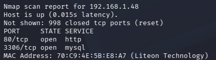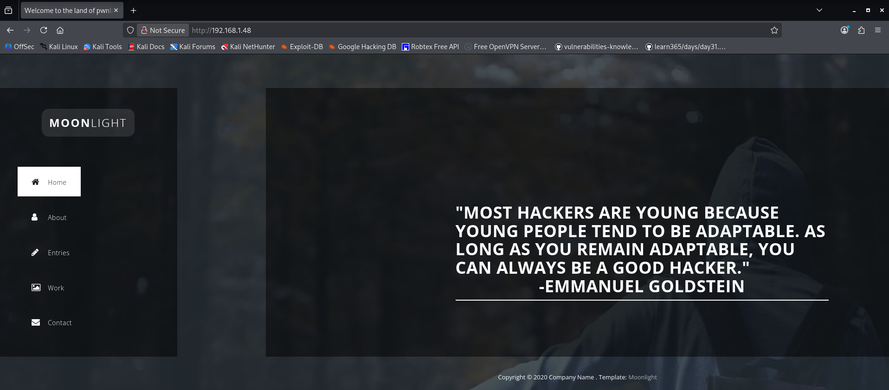

Please Hack Me: 1 Vm:
[<u>https://download.vulnhub.com/hackmeplease/Hack_Me_Please.rar</u>](https://download.vulnhub.com/hackmeplease/Hack_Me_Please.rar)

Difficulty: Easy

Description: An easy box totally made for OSCP. No bruteforce is
required.

Aim: To get root shell

> 1\. Let’s find out our target.
>
> Command:- sudo nmap -sS 192.168.1.0/24.
>
> Use this command to find out service running on different systems in
> your network.
>
> Output:-
>
> Our vulnerable machine is running 2 services.
>
> 2\. Let’s check the application running on port 80:
>
> Feature:- Home, About, Entries, Work, Contract.
>
> 3\. Now Let’s check its source code.

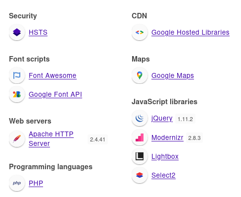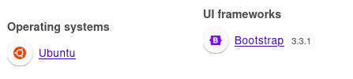

> A **ready-made** **portfolio/landing** **page** **template** Built
> using **Bootstrap** **+** **jQuery**
>
> Structured into **5** **sections** **(slides)**
>
> 4\. Now Let’s Look for technologies:

Directory Brute Force:

> 1\. Tool used: feroxbuster.
>
> Command: feroxbuster --url http://192.168.1.48/ -r -v
>
> Found Directories:-

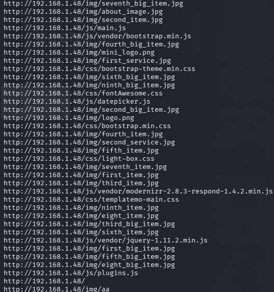

> 2\. Now let’s look which are live : Tool: httpx-toolkit
>
> 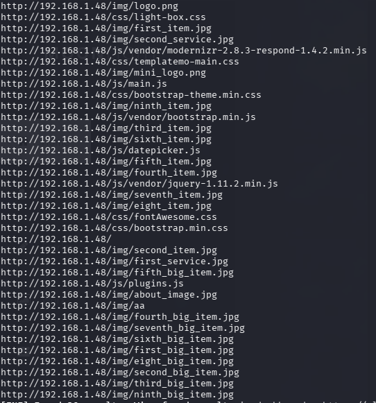 style="width:5.64583in;height:4.22917in" />Command: httpx2 -l
> directories-url.txt -fc 403,404,409 -nc -dashboard

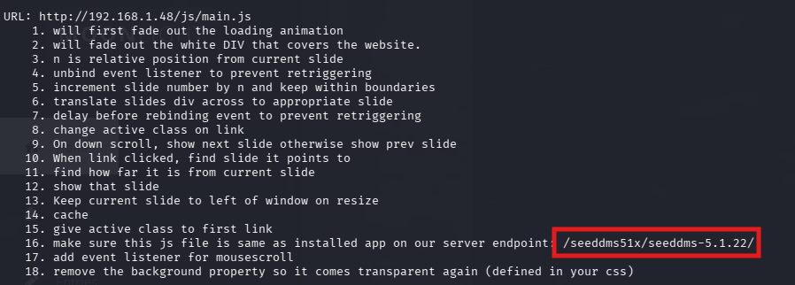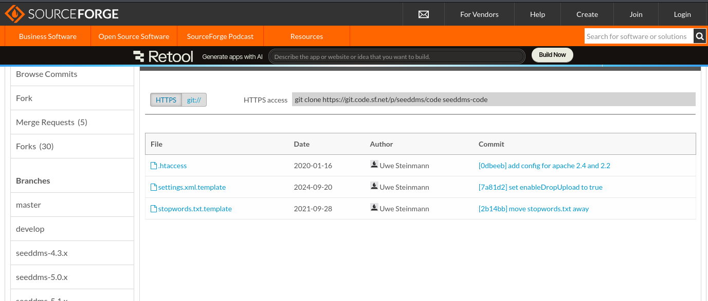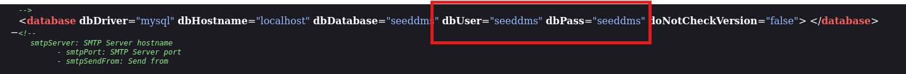

> 3\. Now let’s see the comments available on each url page source code.
> Tool: custom script.
>
> Available here:
>
> We see a path : /seeddms51x/seeddms-5.1.22/ Now let’s check that
> manually.
>
> It redirect’s to seeddms sign in page.
>
> 4\. Now let’s check if source code is available .
>
> Found site:
> [<u>https://sourceforge.net/p/seeddms/code/ci/master/tree/</u>](https://sourceforge.net/p/seeddms/code/ci/master/tree/)
>
> Now let’s check interesting directories: conf
>
> Found three file template .
>
> Look for interesting file : settings.xml.template
>
> This is a template remove template before using that with target as
> file path. Like this :
> [<u>http://192.168.1.48/seeddms51x/conf/settings.xml</u>](http://192.168.1.48/seeddms51x/conf/settings.xml.template)
>
> Mysql user: seeddms Mysql passwd: seeddms

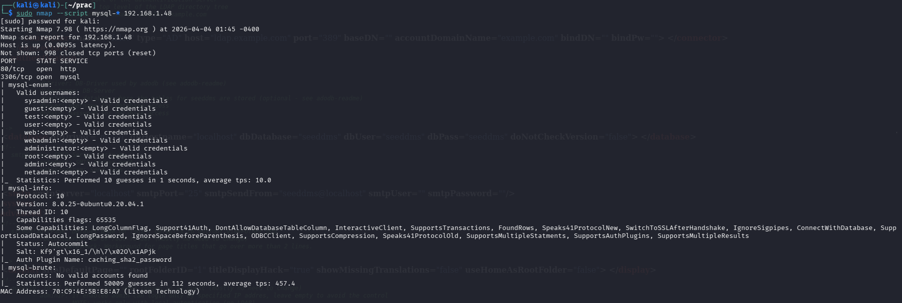

Mysql enumeration:

Command : sudo nmap --script "mysql-\* and not mysql-brute" 192.168.1.48

mysql-info:

\| Protocol: 10

\| Version: 8.0.25-0ubuntu0.20.04.1 mysql-enum:

\| Valid usernames:

\| sysadmin:\<empty\> - Valid credentials \| guest:\<empty\> - Valid
credentials

\| test:\<empty\> - Valid credentials \| user:\<empty\> - Valid
credentials \| web:\<empty\> - Valid credentials

\| webadmin:\<empty\> - Valid credentials

\| administrator:\<empty\> - Valid credentials \| root:\<empty\> - Valid
credentials

\| admin:\<empty\> - Valid credentials

\| netadmin:\<empty\> - Valid credentials

Now let’s check these users and find the user and passwd from above.

It seems that users that we found are only allowed to login from a local
machine and not from a remote host.

Note : commonName=MySQL_Server_8.0.25_Auto_Generated_Server_Certificate

Not valid before: 2021-07-03 Not valid after: 2031-07-01

> ● The server uses an **auto-generated** **SSL** **certificate** ●
> Valid for 10 years
>
> ● Enables encrypted connections.

So command : mysql -h 192.168.1.48 -u seeddms -p --disable-ssl

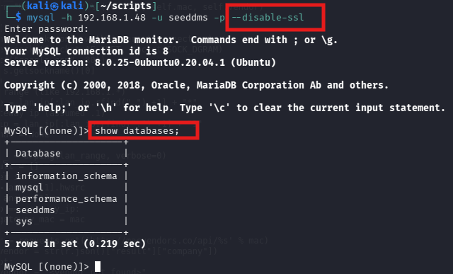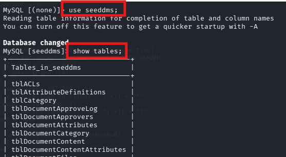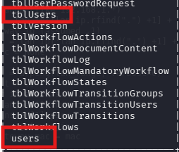

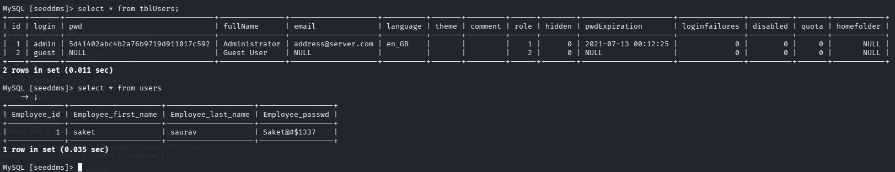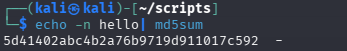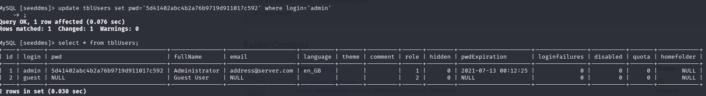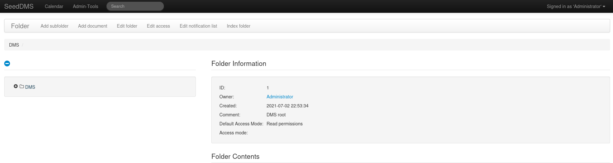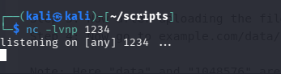

Now let’s change the admin passwd with out md5 hashed passwd. Command :
echo -n hello\| md5sum

Now let’s sign in in seeddms.

Download php reverse-shell :

[<u>https://github.com/pentestmonkey/php-reverse-shell/blob/master/php-reverse-shell.php</u>](https://github.com/pentestmonkey/php-reverse-shell/blob/master/php-reverse-shell.php)

Change the ip according to your ip. Let’s start a netcat listener.

Look at exploit here:
[<u>https://www.exploit-db.com/exploits/47022</u>](https://www.exploit-db.com/exploits/47022)

Use this path to load your file :
[<u>example.com/data/1048576/"document_id"/1.php</u>](http://example.com/data/1048576/%22document_id%22/1.php)

Like this:
[<u>http://192.168.1.38/seeddms51x/data/1048576/4/1.php</u>](http://192.168.1.38/seeddms51x/data/1048576/4/1.php)

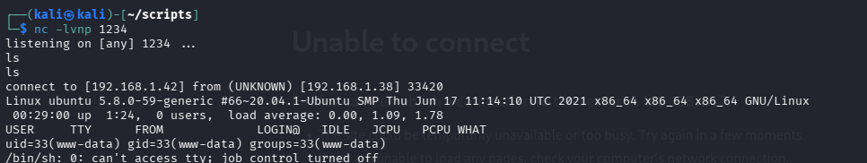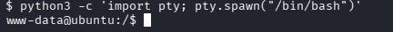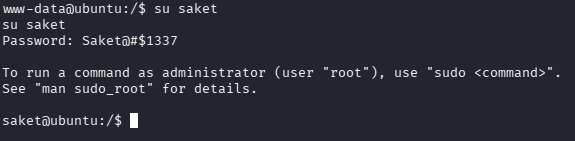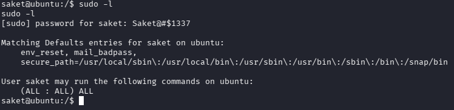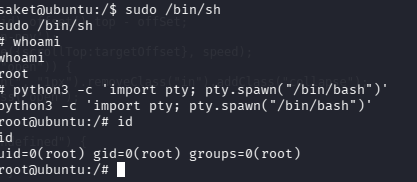

Got The Connection.

Now create an interactive shell:

Command: python3 -c ‘import pty; pty.spawn(“/bin/bash”)’

Now let’s switch to the user we have user name and passwd: User: Saket

Passwd: Saket@#\$1337

Now let’s check the privilege.

Saket can run any command on the shell. Then we just run this : sudo
/bin/sh

DONE!
